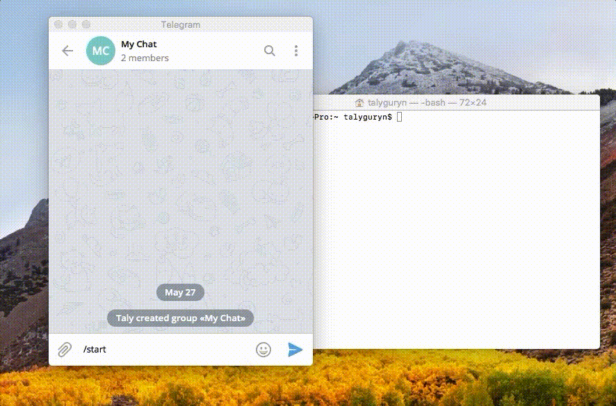

# Notifier

Send messages directly to your Telegram chat or channel via simple POST request.



<!--

# TODO

- [x] add gifs or pics to readme
- [ ] styles for form
- [x] adding buttons with links to form
- [x] describe api in readme
- [x] add link to github project to bot's about
- [x] send links for groups and channels to owner

-->

## How to use

1. Open chat with bot [@wbhkbot](https://t.me/wbhkbot) and run command `/start` to get a link for this chat.

You can add this bot to any group and get a webhook for that chat.

2. Send POST request with params (see below) or open this link in browser to send message via form.

### Webhook for a channel

You can get a link to post messages to channel.

1. Make sure that you have permission to post messages to target channel.

2. Add bot to channel's admins list and give his access to post messages.

3. Forward to chat with bot any message from the channel. You'll get a link.
 
## Send messages

Available POST params 

| Param                      | Default  | Type    | Description                           |
|----------------------------|----------|---------|---------------------------------------|
| `text` or `message`        |          | String  | Message to send                       |
| `parse_mode`               | null     | String  | (optional) `Markdown` or `HTML`       |
| `disable_web_page_preview` | false    | Boolean | (optional) disable links info loading |
| `disable_notification`     | false    | Boolean | (optional) send message silently      |
| `reply_markup`             | null     | String  | (optional) JSON encoded keyboard data |


`reply_markup` used for adding links buttons to your message. See [keyboard data](https://core.telegram.org/bots/api#inlinekeyboardmarkup) in Telegram Bots API.

### `reply_markup` structure with link buttons:

```json
{
  "inline_keyboard": [
    [
      {"text": "Row 1, Link 1", "url": "https://ifmo.su"}
    ],
    [
      {"text": "Row 2, Link 1", "url": "https://ifmo.su"},
      {"text": "Row 2, Link 2", "url": "https://ifmo.su"}
    ]
  ]
}
```

You can add up to 8 buttons in a row and up to 8 rows at total.

### Examples

Send a text message

```shell
curl -X POST https://notifier.exmaple.com/abcdefg12345678hijklmnop \
   -d "text=You have a new email message!"
```

Text message with formatting

```shell
curl -X POST https://notifier.exmaple.com/abcdefg12345678hijklmnop \
   -d "text=*Peter* just logged into the server." \
   -d "parse_mode=Markdown"
```

Hack for attaching image to text message. Use `Markdown` formatting and add link to some image. As a link name you can you zero-space-width symbol called "word joiner". Telegram will preload image and attach it without a visible link. 😉

```shell
curl -X POST https://notifier.exmaple.com/abcdefg12345678hijklmnop \
   -d "text=We have good news for our fans! [⁠](https://capella.pics/69256e83-66e1-449a-b0c2-5414d332e3a6)" \
   -d "parse_mode=Markdown"
``` 

Add button with a link

```shell
curl -X POST https://notifier.exmaple.com/abcdefg12345678hijklmnop \
   -d "text=100 tickets for our conference are available. Hurry up"'!' \
   -d "reply_markup={\"inline_keyboard\":[[{\"text\":\"Buy a ticket\",\"url\":\"ifmo.su\"}]]}"
```

## Issues and improvements

Feel free to ask a questions, report any issues or contribute this project. 

## Development and deployment

Of course you can run your own bot.

1. Clone this repository

```shell
git clone https://github.com/talyguryn/wbhkbot
cd wbhkbot
```

2. Install necessary Node.js dependencies

```shell
npm install --production
```

3. Set up config file

```shell
cp config.sample.js config.js
```

4. Set up your proxy

Sample config for nginx server

```nginx
server {
    listen 80;

    server_name notifier.domain.com;

    include proxy_params;

    location / {
        proxy_pass http://0.0.0.0:3000/;
    }
}

server {
    listen 443 ssl;

    server_name notifier.domain.com;
    
    include snippets/ssl.conf;
    ssl_certificate /etc/letsencrypt/live/notifier.domain.com/fullchain.pem;
    ssl_certificate_key /etc/letsencrypt/live/notifier.domain.com/privkey.pem;
    ssl_trusted_certificate /etc/letsencrypt/live/notifier.domain.com/fullchain.pem;    

    include proxy_params;

    location / {
        proxy_pass http://0.0.0.0:3000/;
    }
}
```

5. Run bot

```shell
npm run start 
```

### Development

1. For development you should install all dependencies

```shell
npm install
```

2. Use [ngrok](ngrok.io) to get temporary domain name with https

```shell
npm install ngrok -g
ngrok http 3000
```

Use url from ngrok (ex: `https://a635e24e.ngrok.io`) as a host in config file. 

3. Build js bundle

```shell
npm run build
```
